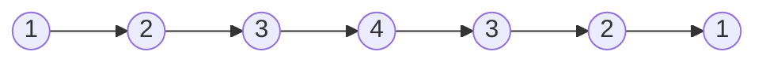
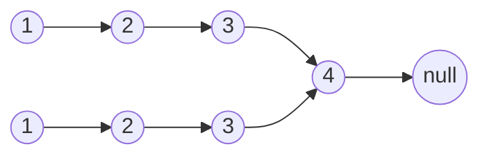
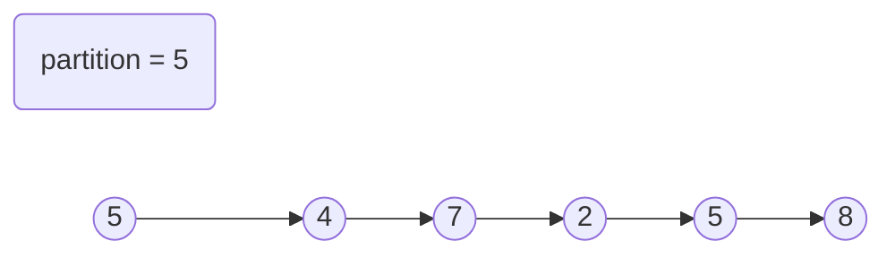
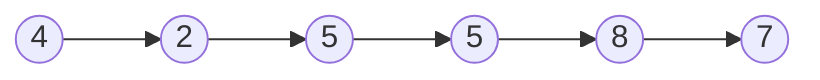
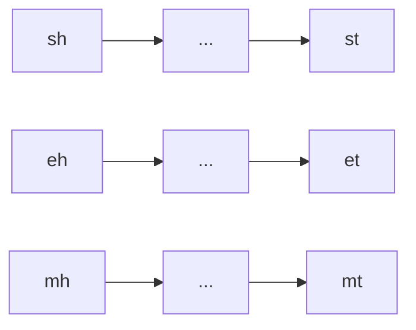
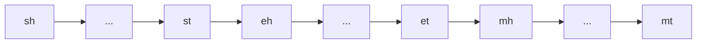
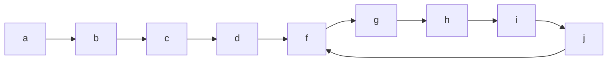
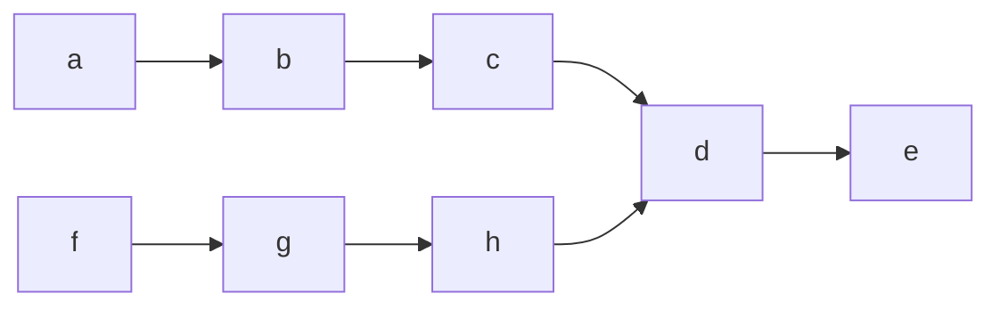

# 链表

## 简介

链表是一种基本的数据结构，它由一系列节点（或称为元素）组成，这些节点在内存中不一定是连续的。每个节点通常包含两部分：一部分是存储数据的数据域，另一部分是存储指向下一个节点地址的指针域。链表的特点是可以动态地添加和删除节点，而且不需要像数组那样在创建时就确定其大小。链表的头节点是指向链表第一个节点的指针，而头指针是链表的入口点，用于访问链表中的元素。

链表有几种类型，包括：

- **单向链表**：每个节点只有一个指针，指向链表中的下一个节点。

- **双向链表**：每个节点有两个指针，一个指向下一个节点，另一个指向前一个节点，允许双向遍历。

- **循环链表**：最后一个节点的指针指向链表的第一个节点，形成一个环状结构。

- **静态链表**：使用数组来模拟链表，每个数组元素存储数据的同时，还存储指向下一个元素的索引。

下面以几个简单的题目例子来说明

> 本文主要说明单向链表
>
> 更多代码(含运行示例)可前往：[Code](https://github.com/heyqing/csdn/tree/master/Algorithm/link)

**注：链表题目一般不会很难，边界条件一定要选对**

## 反转链表

给定一个链表，返回该链表的逆序

### 尾插法

即用一个数组存储正向顺序，再逆向输出并尾插法即可(这里就不代码展示了)

### 头插法

使用递归思想，每次创建的都是后一个

代码展示：

```java
/**
* 反转链表
*
* @param head
* @return
*/
public static ListNode reverseLinked(ListNode head) {
    return achieveFuncReverse(head, null);
}

/**
* 反转链表实现函数
*
* @param head
* @param last
* @return
*/
private static ListNode achieveFuncReverse(ListNode head, ListNode last) {
    if (Objects.isNull(head)) return last; // 如果需反转链表为空返回
    // 将当前head值放入新node，将上一步的node放入next
    ListNode cur = new ListNode(head.val, last); 
    //递归调用创建上一个
    return achieveFuncReverse(head.next, cur);
}
```

## 回文链表

给定一个链表判断当前链表是否为回文链表

回文链表： 正向读等于反向读的链表，1-> 2 -> 3 -> 4 -> 3 -> 2 -> 1, 1 -> 2 -> 3 -> 3 -> 2 -> 1

### 辅助空间 - 栈 - 全压栈

使用栈将链表中的所有值压入栈中，再从头遍历链表，每遍历一个栈中弹出一个，若全部相等则为回文链表，反之则不然

___代码后面统一展示___

### 辅助空间 - 栈 - 压一半

只将链表中的一半数据压入栈中，然后与另一半进行比较，相当于将链表进行对折

如何只压一半，或者说压到哪里就说明已经压了一半了，这里就要介绍一种方法——**快慢指针**

使用快慢指针找链表中点，即快指针一次走两步，慢指针一次走一步，当快指针走到最后时慢指针刚刚到达链表中间

### 快慢指针 - 反转链表 - 不使用辅助空间

第三种方法只使用有限的变量而不去借助栈等辅助空间

使用快慢指针，当慢指针到达中点时，将当前慢指针指向空，慢指针后面的逆序，然后一边从头，一边从尾依次遍历比较

举例说明一下，元链表为



转换之后的为



然后从两边同步遍历，过程中若有一步不同则不是回文，若遍历到最后有一处为null，则说明过程中处处相等，即回文

### 所有代码展示

```java
package com.heyqing;

import java.util.Objects;
import java.util.Stack;

import static com.heyqing.LinkTools.*;

/**
 * ClassName:IsPalindrome
 * Package:com.heyqing
 * Description:
 * 回文链表
 *
 * @Date:2024/10/19
 * @Author:Heyqing
 */
public class IsPalindrome {

    /**
     * 栈 - 全压
     *
     * @param head
     * @return
     */
    public static boolean isPalindromeV1(ListNode head) {
        Stack<Integer> stack = new Stack<>();
        ListNode p = head;
        while (Objects.nonNull(p)) {
            stack.push(p.val);
            p = p.next;
        }
        while (Objects.nonNull(head)) {
            if (stack.pop() - head.val != 0) return false;
            head = head.next;
        }
        return true;
    }


    /**
     * 栈 - 压一半
     *
     * @param head
     * @return
     */
    public static boolean isPalindromeV2(ListNode head) {
        Stack<Integer> stack = new Stack<>();
        /*
        快慢指针
         */
        if (Objects.isNull(head) || Objects.isNull(head.next) || Objects.isNull(head.next.next)) {
            return judgeLinkedLengthLess3(head);
        }
        ListNode quick = head.next.next;
        ListNode slow = head.next;
        stack.push(head.val);
        while (Objects.nonNull(quick) && Objects.nonNull(quick.next)) {
            quick = quick.next.next;
            stack.push(slow.val);
            slow = slow.next;
        }
        if (Objects.nonNull(quick)) slow = slow.next;
        while (Objects.nonNull(slow)) {
            if (stack.pop() - slow.val != 0) return false;
            slow = slow.next;
        }
        return true;
    }

    /**
     * 快慢指针 - 反转后一半
     * <p>
     * 不使用额外空间（有限的几个变量）
     *
     * @param head
     * @return
     */
    public static boolean isPalindromeV3(ListNode head) {
        if (Objects.isNull(head) || Objects.isNull(head.next) || Objects.isNull(head.next.next)) {
            return judgeLinkedLengthLess3(head);
        }
        ListNode quick = head;
        ListNode slow = head;
        ListNode reverse = null;
        while (Objects.nonNull(quick.next) && Objects.nonNull(quick.next.next)) {
            slow = slow.next;
            quick = quick.next.next;
        }
        /*
         快指针指向慢指针
         慢指针指向空
         使用reverse反转
         */
        quick = slow.next;
        slow.next = null;
        while (Objects.nonNull(quick)) {
            //记录下一个
            reverse = quick.next;
            //反转 指向上一个
            quick.next = slow;
            //记录当前位置，下一个的上一个
            slow = quick;
            //跳转至下一个
            quick = reverse;
        }
        quick = head;
        while (Objects.nonNull(slow) && Objects.nonNull(quick)) {
            if (slow.val != quick.val) return false;
            slow = slow.next;
            quick = quick.next;
        }
        return true;
    }

    /**
     * 长度小于 3 的链表
     *
     * @param head
     * @return
     */
    private static boolean judgeLinkedLengthLess3(ListNode head) {
        if (Objects.isNull(head) || Objects.isNull(head.next)) {
            return true;
        }
        if (Objects.isNull(head.next.next)) {
            return head.val == head.next.val;
        } else {
            return head.val == head.next.next.val;
        }
    }
}
```

## 划分链表

给定一个链表，和一个划分数值 partition，结果将小于partition的node置于左边，等于的放中间，大于的放右边

与荷兰国旗问题一致，有关荷兰国旗问题，在 [十大经典排序](https://blog.csdn.net/heyiqingsong/article/details/143024462) 中的**快速**排序**代码**中有所提及



划分后的链表为



小于、大于区域的node顺序不做要求

### 辅助空间 - 数组

将node存入数组，对数组进行荷兰国旗式的划分，再将node依次串起来

### 有限变量 - 不使用辅助空间

只是用7个变量实现划分，且保证稳定性

定义node变量 小于首sh，小于尾st，等于首eh，等于尾et，大于首mh，大于尾mt，下一节点next

从头遍历链表若小于partition，若sh为空将sh指向当前节点，将st的下一节点指向当前节点，然后将st等图当前节点，依次进行，等于大于同理，最后将两条链表串起来

举例说明，依次获得三条链表



然后将三条链表串起来即可



### 所有代码展示

```java
package com.heyqing;

import java.util.ArrayList;
import java.util.List;
import java.util.Objects;

/**
 * ClassName:PartitionLinked
 * Package:com.heyqing
 * Description:
 * 划分链表
 *
 * @Date:2024/10/19
 * @Author:Heyqing
 */
public class PartitionLinked {

    /**
     * 划分链表 - 数组
     *
     * @param head
     * @return
     */
    public static ListNode partitionLinkedV1(ListNode head, int target) {
        if (Objects.isNull(head)) return null;
        List<ListNode> listNodes = new ArrayList<>();
        while (Objects.nonNull(head)) {
            listNodes.add(head);
            head = head.next;
        }
        //划分
        int size = listNodes.size(), min = -1, max = size;
        for (int i = 0; i < max; i++) {
            if (listNodes.get(i).val < target) {
                //小于
                swap(listNodes, i, min + 1);
                min++;
            } else if (listNodes.get(i).val > target) {
                //大于
                swap(listNodes, i, max - 1);
                i--;
                max--;
            }
        }
        //串起来
        ListNode result = new ListNode();
        ListNode p = result;
        for (int i = 0; i < size; i++) {
            p.next = listNodes.get(i);
            p = p.next;
        }
        p.next = null;
        return result.next;
    }

    /**
     * 划分链表 - 有限变量
     * <p>
     * 保证稳定性
     *
     * @param head
     * @param target
     * @return
     */
    public static ListNode partitionLinkedV2(ListNode head, int target) {
        //定义小于 等于 大于 的首位指针
        ListNode sh = null, st = null, eh = null, et = null, mh = null, mt = null, next = null;
        while (Objects.nonNull(head)) {
            next = head.next;
            head.next = null;
            if (head.val < target) {
                //小于
                if (Objects.isNull(sh)) {
                    sh = head;
                } else {
                    st.next = head;
                }
                st = head;
            } else if (head.val == target) {
                //等于
                if (Objects.isNull(eh)) {
                    eh = head;
                } else {
                    et.next = head;
                }
                et = head;
            } else {
                //大于
                if (Objects.isNull(mh)) {
                    mh = head;
                } else {
                    mt.next = head;
                }
                mt = head;
            }
            head = next;
        }
        if (Objects.nonNull(st)) {
            st.next = eh;
            et = Objects.isNull(et) ? st : et;
        }
        if (Objects.nonNull(et)) {
            et.next = mh;
        }
        return Objects.nonNull(sh) ? sh : (Objects.nonNull(eh) ? eh : mh);
    }

    private static void swap(List<ListNode> listNodes, int i, int j) {
        ListNode temp = listNodes.get(i);
        listNodes.set(i, listNodes.get(j));
        listNodes.set(j, temp);
    }

}
```

## 判断成环链表

给定一个链表判断链表中是否有环

环形链表展示



### 辅助空间 - 集合

使用set集合存储节点hashCode或地址，若添加成功继续，否则成环，第一个失败的为入环节点

若遍历至空则说明不成环

### 快慢指针 - 不使用辅助空间

快指针一次走两步，慢指针一次一步，若快指针为空则不成环，否则快慢指针必相遇，相遇即成环

相遇后快指针指向头，慢指针不动，然后快慢指针一次都走一步，再相遇时的节点为入环节点

___代码在相交链表中一同展示（下一问题）___

## 相交链表

给定两个链表，有可能成环有可能不成环，判断这两个链表是否相交

**两个都不成环**：只有一种情况



这种情况下相同特征为相交节点后的节点相同（hashCode或地址），也就是说最后一个节点的hashCode或地址必相同 ——相同即相交，不相同即不相交

**一个成环一个不成环**：必不相交

**两个都成环**:有三种情况

- 不相交 - 各自成环 - 入环节点不同

  ```mermaid
  graph LR
   a --> b
   b --> c
   c --> d
   d --> f
   f --> e
   e --> d
   1 -->2
   2 -->3
   3 -->4
   4 -->5
   5 -->6
   6 -->4
  ```

- 相交 - 入环节点相同

  ```mermaid
  graph LR
  a --> b
  b --> c
  c --> d
  d --> A
  A --> B
  B --> C
  C --> D
  D --> B
  1 --> 2
  2 --> 3
  3 --> 4
  4 --> A
  ```

- 相交 - 入环节点不同

  ```mermaid
  graph LR
  1 --> 2
  2 --> 3
  3 --> 4
  a --> b
  b --> c
  c --> d
  A --> B
  B --> C
  C --> D
  D --> F
  F --> A
  4 --> A
  d --> D
  ```

相同入环节点，必相交

不同入环节点，两链表各自都移动至入环节点，一个不动 (head1)，另一个移动一圈(head2)，若在移动过程中head2的hashCode或地址等于head1则说明相交，反之则不相交

### 代码展示

```java
package com.heyqing;

import java.util.*;

/**
 * ClassName:HasCycle
 * Package:com.heyqing
 * Description:
 * 环形链表
 *
 * @Date:2024/10/19
 * @Author:Heyqing
 */
public class HasCycle {

    /**
     * 判断成环 -集合
     *
     * @param head
     * @return
     */
    public static boolean hasCycleV1(ListNode head) {
        /*
        使用hashcode与set
         */
        Set<Integer> set = new HashSet<>();
        while (Objects.nonNull(head)) {
            if (!set.add(head.hashCode())) return true;
            head = head.next;
        }
        return false;
    }

    /**
     * 判断成环 -快慢指针
     *
     * @param head
     * @return
     */
    public static boolean hasCycleV2(ListNode head) {
        ListNode quick = head;
        ListNode slow = head;
        while (Objects.nonNull(quick) && Objects.nonNull(quick.next)) {
            quick = quick.next.next;
            slow = slow.next;
            if (Objects.equals(quick, slow)) return true;
        }
        return false;
    }

    /**
     * 获取入环节点
     *
     * @param head
     * @return
     */
    public static List<Integer> getEnterCycleNode(ListNode head) {
        /*
        获取入环节点有多种解，这里只说明快慢指针的方式
        快指针一次两步，慢指针一次一步
        相遇后，慢指针不动，快指针指向头部
        再次相遇节点为入环节点
         */
        if (Objects.isNull(head)) return null;
        List<Integer> list = new ArrayList<>(3);
        ListNode quick = head;
        ListNode slow = head;
        while (Objects.nonNull(quick) && Objects.nonNull(quick.next)) {
            quick = quick.next.next;
            slow = slow.next;
            if (Objects.equals(quick, slow)) break;
        }
        quick = head;
        int count = 1;
        while (Objects.nonNull(quick)) {
            count++;
            quick = quick.next;
            slow = slow.next;
            if (Objects.equals(quick, slow)) break;
        }
        list.add(count);
        list.add(quick.val);
        list.add(quick.hashCode());
        return list;
    }

    /**
     * 判断相交链表
     * <p>
     * 成环 - 相交 / 不相交
     * 不成环 - 相交 / 不相交
     *
     * @param head1
     * @param head2
     * @return
     */
    public static boolean intersectLinked(ListNode head1, ListNode head2) {
        //判断有无环
        boolean isCycleByHead1 = hasCycleV2(head1);
        boolean isCycleByHead2 = hasCycleV2(head2);
        if ((isCycleByHead1 && !isCycleByHead2) || (!isCycleByHead1 && isCycleByHead2)) {
            //一个成环一个不成环 - 必不相交
            return false;
        }
        //不成环
        if (!isCycleByHead1) {
            return intersectLinkedByNoCycle(head1, head2);
        }
        //成环
        return intersectLinkedByCycle(head1, head2);
    }

    /**
     * 判断相交 - 成环
     *
     * @param head1
     * @param head2
     * @return
     */
    private static boolean intersectLinkedByCycle(ListNode head1, ListNode head2) {
        /*
        获取其入环节点
        如果其入环节点相等必相交
        如果不等分各自成环（2个环），共成环（1个环）
        入环后一个不动，一个走一圈，若期间碰到相交反之不相交
         */
        ListNode cur2 = head2;
        List<Integer> enterCycleNodeByHead1 = getEnterCycleNode(head1);
        List<Integer> enterCycleNodeByHead2 = getEnterCycleNode(head2);
        Integer head1Point = enterCycleNodeByHead1.get(2);
        Integer head2Point = enterCycleNodeByHead2.get(2);
        //让 cur1不动
        while (cur2.hashCode() != head2Point) {
            cur2 = cur2.next;
        }
        cur2 = cur2.next;
        while (cur2.hashCode() != head2Point) {
            if (cur2.hashCode() == head1Point) return true;
            cur2 = cur2.next;
        }
        return false;
    }

    /**
     * 判断相交 - 无环
     *
     * @param head1
     * @param head2
     * @return
     */
    private static boolean intersectLinkedByNoCycle(ListNode head1, ListNode head2) {
        ListNode cur1 = head1, cur2 = head2;
        while (Objects.nonNull(cur1.next)) {
            cur1 = cur1.next;
        }
        while (Objects.nonNull(cur2.next)) {
            cur2 = cur2.next;
        }
        /*
        如果相交，最后必有相等部分，其中最后一个比相等
        若不等就不相交
         */
        return cur1.hashCode() == cur2.hashCode();
    }
}
```

