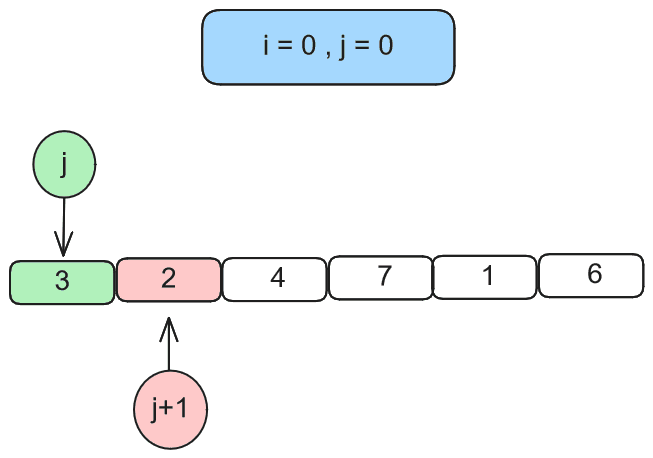
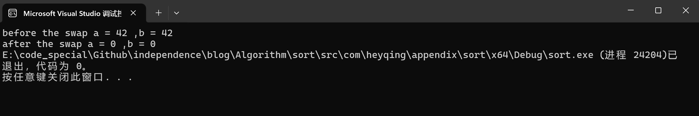

# 十大经典排序

## 简介

  这里所说的十大经典排序指的分别为：冒泡排序（Bubble Sort）、选择排序（Selection Sort）、插入排序（Insertion Sort）、快速排序（Quick Sort）、归并排序（Merge Sort）、堆排序（Heap Sort）、希尔排序（Shell Sort）、计数排序（Counting Sort）、基数排序（Radix Sort）、桶排序（Bucket Sort）

这些排序算法根据不同的特点可以被分为以下几类：

- **比较排序**：通过比较元素之间的大小关系来进行排序。包括冒泡排序、选择排序、插入排序、快速排序、归并排序、堆排序、希尔排序。
- **非比较排序**：不通过比较元素的大小关系来进行排序，而是通过其他方法确定元素的顺序。包括计数排序、基数排序、桶排序。

下面我会对这十种算法依次进行说明

## 冒泡排序（Bubble Sort）

### 算法描述

冒泡排序是一种简单的排序算法，它通过重复地遍历要排序的数列，一次比较两个元素，如果它们的顺序错误就把它们交换过来。遍历数列的工作是重复地进行直到没有再需要交换，也就是说该数列已经排序完成。

### 算法步骤

1. 比较相邻的元素。如果第一个比第二个大（升序排序），就交换它们两个。
2. 对每一对相邻元素做同样的工作，从开始第一对到结尾的最后一对。这步做完后，最后的元素会是最大的数。
3. 针对所有的元素重复以上的步骤，除了最后一个。
4. 重复步骤1~3，直到排序完成。

### 时间复杂度

- 最好情况（已排序）：$O(n)$，当输入的数组已经是正序时，冒泡排序只需遍历一次数组即可。
- 最坏情况（逆序）：$O(n^2)$，当输入的数组是逆序时，需要进行最大次数的比较和交换。
- 平均情况：$O(n^2)$，平均情况下，冒泡排序的时间复杂度也是$O(n^2)$。

### 空间复杂度

- 常数额外空间：$O(1)$，冒泡排序只需要一个用于交换的临时变量，所以它的空间复杂度是$O(1)$。

### 动态解释



### 代码实现

```java
package com.heyqing;

/**
 * ClassName:BubbleSort
 * Package:com.heyqing
 * Description:
 * 冒泡排序
 *
 * @Date:2024/10/16
 * @Author:Heyqing
 */
public class BubbleSort {
    /**
     * 外部调用接口
     *
     * @param source
     */
    public static void sort(int[] source) {
        bubble(source);
    }

    /**
     * 排序具体实现
     *
     * @param nums
     */
    private static void bubble(int[] nums) {
        boolean flag; // 内层是否有序标志
        //第一层 不用判断最后一个数
        for (int i = 0; i < nums.length - 1; i++) {
            flag = false;
            //第二层 不用判断最后i躺个数
            for (int j = 0; j < nums.length - 1 - i; j++) {
                //如果前一个数 大于 后一个数
                if (nums[j] > nums[j + 1]) {
                    //交换两个数
                    swap(nums, j);
                    flag = true;
                }
            }
            // 如果内层循环没有进行交换，说明数组已经有序，可以提前结束排序
            if (!flag) break;
        }
    }

    /**
     * 交换两个数
     * <p>
     * index 与 index + 1 进行交换
     *
     * @param nums
     * @param index
     */
    private static void swap(int[] nums, int index) {
        /*
         若 a = nums[index] , b = nums[index + 1]
         第一行： a = a ^ b 此时： a = a ^ b ,b = b
         第二行： b = (a ^ b) ^ b = a 此时： a = a ^ b , b = a
         第三行： a = (a ^ b) ^ a = b 此时： a = b , b = a 完成交换
         此算法实现了不使用额外空间完成两数交换
         注意：使用此算法时要保证 a , b 不同内存空间，错误用例见附录
         */
        nums[index] = nums[index] ^ nums[index + 1];
        nums[index + 1] = nums[index] ^ nums[index + 1];
        nums[index] = nums[index] ^ nums[index + 1];
    }
}
```

## 选择排序（Selection Sort）

### 算法描述

选择排序是一种简单直观的排序算法。该算法每次循环从未排序的部分找到最小（或最大）的元素，将其放到已排序部分的末尾。这个过程重复进行，直到整个数组排序完成。

### 算法步骤

1. 在未排序序列中找到最小（或最大）元素的索引。
2. 将最小（或最大）元素与未排序序列的第一个元素交换位置。
3. 在剩下的未排序元素中重复步骤1和2，直到所有元素均排序完毕。

### 时间复杂度

- 最好、最坏和平均情况的时间复杂度都是$ O(n^2)$，因为选择排序需要进行大约 $n/2$ 次的交换操作，并且每次交换操作都需要遍历剩余的未排序部分。

### 空间复杂度

- 空间复杂度是 $O(1)$，因为选择排序是在原地进行的，不需要额外的存储空间。

### 动态解释

数组：[64, 25, 12, 22, 11]

1. 第一轮找到最小元素11，与第一个元素64交换位置，数组变为：[11, 25, 12, 22, 64]
2. 第二轮找到除11之外的最小元素12，与第二个元素25交换位置，数组变为：[11, 12, 25, 22, 64]
3. 第三轮找到除11和12之外的最小元素22，与第三个元素25交换位置，数组变为：[11, 12, 22, 25, 64]
4. 最后一轮，25和64已经是有序的，不需要交换。

### 代码实现

```java
package com.heyqing;

/**
 * ClassName:SelectionSort
 * Package:com.heyqing
 * Description:
 * 选择排序
 *
 * @Date:2024/10/16
 * @Author:Heyqing
 */
public class SelectionSort {

    /**
     * 外部调用接口
     *
     * @param source
     */
    public static void sort(int[] source) {
        selection(source);
    }

    /**
     * 排序具体实现
     *
     * @param nums
     */
    private static void selection(int[] nums) {
        for (int i = 0; i < nums.length - 1; i++) {
            int minTemp = i; // 找到从i开始到数组末尾的最小元素的索引
            for (int j = i + 1; j < nums.length; j++) {
                if (nums[j] < nums[minTemp]) minTemp = j;
            }
            // 将找到的最小元素与第i个位置的元素交换
            swap(nums, i, minTemp);
        }
    }

    /**
     * 交换两个数 常规做法
     *
     * @param nums
     * @param i
     * @param j
     */
    private static void swap(int[] nums, int i, int j) {
        int temp = nums[i];
        nums[i] = nums[j];
        nums[j] = temp;
    }
}
```

## 插入排序（Insertion Sort）

### 算法描述

插入排序是一种简单的排序算法，它的工作原理是通过构建有序序列，对于未排序数据，在已排序序列中从后向前扫描，找到相应位置并插入。

### 算法步骤

1. 从第一个元素开始，该元素可以认为已经被排序。
2. 取出下一个元素，在已经排序的元素序列中从后向前扫描。
3. 如果该元素（已排序）大于新元素，将该元素移到下一位置。
4. 重复步骤3，直到找到已排序的元素小于或者等于新元素的位置。
5. 将新元素插入到该位置后。
6. 重复步骤2~5。

### 时间复杂度

- 最好情况（数组已经是有序的）：$O(n)$
- 最坏情况（数组是完全逆序的）：$O(n^2)$
- 平均情况：$O(n^2)$

### 空间复杂度

- 空间复杂度是 $O(1)$，因为插入排序是在原地进行的，不需要额外的存储空间。

### 动态解释

数组：[5, 2, 4, 6, 1, 3]

1. 初始状态：[5]（5是第一个元素，已经有序）
2. 插入2到5之前：[2, 5]
3. 插入4到[2, 5]之前，需要将5向后移动：[2, 4, 5]
4. 插入6到[2, 4, 5]之后，因为6比5大：[2, 4, 5, 6]
5. 插入1到[2, 4, 5, 6]之前，需要将所有元素向后移动：[1, 2, 4, 5, 6]
6. 插入3到[1, 2, 4, 5, 6]之前，需要将4和5向后移动：[1, 2, 3, 4, 5, 6]

### 代码实现

```java
package com.heyqing;

/**
 * ClassName:InsertionSort
 * Package:com.heyqing
 * Description:
 * 插入排序
 *
 * @Date:2024/10/16
 * @Author:Heyqing
 */
public class InsertionSort {
    /**
     * 外部调用接口
     *
     * @param source
     */
    public static void sort(int[] source) {
        insertion(source);
    }

    /**
     * 排序具体实现
     *
     * @param nums
     */
    private static void insertion(int[] nums) {
        for (int i = 1; i < nums.length; i++) {
            int key = nums[i];
            int j = i - 1;
            //将大于key的元素向后移动
            while (j >= 0 && nums[j] > key) {
                nums[j + 1] = nums[j];
                j -= 1;
            }
            //插入key到正确的位置
            nums[j + 1] = key;
        }
    }
}
```

## 快速排序（Quick Sort）

### 算法描述

快速排序是一种分而治之的排序算法。它通过选取一个“基准”元素，将数组分成两个子数组，一个包含小于基准的元素，另一个包含大于或等于基准的元素，然后递归地对这两个子数组进行快速排序。

### V1.0

#### 算法步骤

使用最后一个数 n 作为划分值
使得n前面的所有数以荷兰国旗式划分开
划分完后使用大于区域的第一个数与 n 交换
然后对 n 左右区域做递归处理

#### 时间复杂度

- 最好情况：$O(n log n)$，每次分区操作都能将数组分为两个大小相等的子数组。
- 最坏情况：$O(n^2)$，当每次分区操作只减少一个元素时，例如数组已经是有序的。

#### 空间复杂度

- 空间复杂度是$ O(log n)$，这是因为快速排序的递归性质，需要使用递归栈空间。

### V2.0

#### 算法步骤

使用最后一个数 n 作为划分值
使得n前面的所有数以荷兰国旗式划分开
划分完后使用大于区域的第一个数与 n 交换
然后对 n 左右区域做递归处理
与第一版不同的是将等于部分置于中间

#### 时间复杂度

- 最好情况：$O(n log n)$，每次分区操作都能将数组分为两个大小相等的子数组。
- 最坏情况：$O(n^2)$，当每次分区操作只减少一个元素时，例如数组已经是有序的。

#### 空间复杂度

- 空间复杂度是$ O(log n)$，这是因为快速排序的递归性质，需要使用递归栈空间。

### V3.0

#### 算法步骤

随机选择数组中的一个数作为分界数
使得n前面的所有数以荷兰国旗式划分开
划分完后使用大于区域的第一个数与 n 交换
然后对 n 左右区域做递归处理
与第二版不同的是随机选取数EX = n log n

#### 时间复杂度

- 最好情况：$O(n log n)$，每次分区操作都能将数组分为两个大小相等的子数组。
- 最坏情况：$O(n log n)$，当每次分区操作只减少一个元素时，例如数组已经是有序的。

#### 空间复杂度

- 空间复杂度是$ O(log n)$，这是因为快速排序的递归性质，需要使用递归栈空间。

### 代码实现

```java
package com.heyqing;

import java.util.Arrays;
import java.util.Random;

/**
 * ClassName:QuickSort
 * Package:com.heyqing
 * Description:
 * 快速排序
 *
 * @Date:2024/10/16
 * @Author:Heyqing
 */
public class QuickSort {

    /**
     * 外部调用接口 - 第一版本
     *
     * @param source
     */
    public static void sortV1(int[] source) {
        quickV1(source);
    }

    /**
     * 外部调用接口 - 第二版本
     *
     * @param source
     */
    public static void sortV2(int[] source) {
        quickV2(source);
    }

    /**
     * 外部调用接口 - 第三版本
     *
     * @param source
     */
    public static void sortV3(int[] source) {
        quickV3(source);
    }

    /**
     * 外部调用接口 - Java库函数
     *
     * @param source
     */
    public static void sort(int[] source) {
        quick(source);
    }

    /**
     * 排序具体实现 - v1
     *
     * @param nums
     */
    private static void quickV1(int[] nums) {
        /*
         使用最后一个数 n 作为划分值
         使得n前面的所有数以荷兰国旗式划分开
         划分完后使用大于区域的第一个数与 n 交换
         然后对 n 左右区域做递归处理
         */
        int start = 0, end = nums.length;
        achieveFunctionQuickV1(nums, start, end);
    }

    /**
     * 实现函数 - v1
     *
     * @param nums
     * @param start
     * @param end
     */
    private static void achieveFunctionQuickV1(int[] nums, int start, int end) {
        if (start >= end) return;
        int position = DutchFlagV1(nums, start, end);
        swap(nums, position + 1, end - 1);
        //左边
        achieveFunctionQuickV1(nums, start, position + 1);
        //右边
        achieveFunctionQuickV1(nums, position + 2, end);
    }


    /**
     * 排序具体实现 - v2
     *
     * @param nums
     */
    private static void quickV2(int[] nums) {
        /*
         使用最后一个数 n 作为划分值
         使得n前面的所有数以荷兰国旗式划分开
         划分完后使用大于区域的第一个数与 n 交换
         然后对 n 左右区域做递归处理
         与第一版不同的是将等于部分置于中间
         */
        int start = 0, end = nums.length;
        achieveFunctionQuickV2(nums, start, end);
    }

    /**
     * 实现函数 - v2
     *
     * @param nums
     * @param start
     * @param end
     */
    private static void achieveFunctionQuickV2(int[] nums, int start, int end) {
        if (start >= end) return;
        //一最后一个数为分界数，返回第一个大于和最后一个小于分界数的下标
        int[] positions = DutchFlagV2(nums, start, end);
        //左边
        achieveFunctionQuickV2(nums, start, positions[0]);
        //右边
        achieveFunctionQuickV2(nums, positions[1], end);
    }


    /**
     * 排序具体实现 - v3
     *
     * @param nums
     */
    private static void quickV3(int[] nums) {
        /*
         随机选择数组中的一个数作为分界数
         使得n前面的所有数以荷兰国旗式划分开
         划分完后使用大于区域的第一个数与 n 交换
         然后对 n 左右区域做递归处理
         与第二版不同的是随机选取数EX = n log n
         */
        int start = 0, end = nums.length;
        achieveFunctionQuickV3(nums, start, end);
    }

    /**
     * 实现函数 - v3
     *
     * @param nums
     * @param start
     * @param end
     */
    private static void achieveFunctionQuickV3(int[] nums, int start, int end) {
        if (start >= end) return;
        //随机选取
        Random r = new Random();
        int randomIndex = r.nextInt(end - start) + start;
        swap(nums, randomIndex, end - 1);
        int[] positions = DutchFlagV3(nums, start, end);
        //左边
        achieveFunctionQuickV3(nums, start, positions[0] + 1);
        //右边
        achieveFunctionQuickV3(nums, positions[1], end);
    }


    /**
     * 排序具体实现 - java依赖库
     * <p>
     * 双轴快速排序（Dual-Pivot Quicksort）算法
     *
     * @param nums
     */
    private static void quick(int[] nums) {
        /*
         Java中的Arrays.sort方法底层使用的排序算法依赖于数组的类型和大小。对于基本数据类型数组（如int[], long[]等）
         Arrays.sort使用的是双轴快速排序（Dual-Pivot Quicksort）算法，这是一种优化过的快速排序算法
         由Vladimir Yaroslavskiy、Jon Bentley和Joshua Bloch提出
         它在许多数据集上提供了接近O(n log n)的性能，通常比传统的单轴快速排序更快
         */
        Arrays.sort(nums);
    }


    /**
     * 荷兰国旗算法 - v1
     * <p>
     * 给定一个数组 nums 数组中的最后一个数为 target
     * <p>
     * 要求将数组 nums 中所有小于等于 target 的数置于左侧，大于的数置于右侧
     * <p>
     * 返回分界值 position ：小于等于 position 的数值为 小于等于 target 的值
     *
     * @param nums
     * @param start
     * @param end
     * @return
     */
    private static int DutchFlagV1(int[] nums, int start, int end) {
        int len = end - start, position = start - 1, target = nums[end - 1];
        for (int i = start; i < len - 1; i++) {
            if (nums[i] <= target) {
                swap(nums, i, position + 1);
                position++;
            }
        }
        return position;
    }


    /**
     * 荷兰国旗算法 - v2
     * <p>
     * 给定一个数组 nums 数组中的最后一个数为 target
     * <p>
     * 要求将数组 nums 中所有小于 target 的数置于左侧，等于的数置于中间，大于的数置于右侧
     * <p>
     * 返回分界值 positions ：小于的边界，大于的边界
     *
     * @param nums
     * @param start
     * @param end
     * @return
     */
    private static int[] DutchFlagV2(int[] nums, int start, int end) {
        int target = nums[end - 1];
        //初始化边界数组
        int[] positions = new int[]{start - 1, end};
        for (int i = start; i < positions[1]; i++) {
            if (nums[i] < target) {
                //小于
                swap(nums, i, positions[0] + 1);
                positions[0]++;
            } else if (nums[i] > target) {
                //大于
                swap(nums, i, positions[1] - 1);
                positions[1]--;
                i--;
            }
        }
        return positions;
    }

    /**
     * 荷兰国旗算法 - v3
     * <p>
     * 给定一个数组 nums 数组中的随机一个数为 target
     * <p>
     * 要求将数组 nums 中所有小于 target 的数置于左侧，等于的数置于中间，大于的数置于右侧
     * <p>
     * 返回分界值 positions ：小于的边界，大于的边界
     *
     * @param nums
     * @param start
     * @param end
     * @return
     */
    private static int[] DutchFlagV3(int[] nums, int start, int end) {
        int target = nums[end - 1];
        //初始化边界数组
        int[] positions = new int[]{start - 1, end};
        for (int i = start; i < positions[1]; i++) {
            if (nums[i] < target) {
                //小于
                swap(nums, i, positions[0] + 1);
                positions[0]++;
            } else if (nums[i] > target) {
                //大于
                swap(nums, i, positions[1] - 1);
                positions[1]--;
                i--;
            }
        }
        return positions;
    }

    /**
     * 交换两个数
     *
     * @param nums
     * @param i
     * @param j
     */
    private static void swap(int[] nums, int i, int j) {
        int temp = nums[i];
        nums[i] = nums[j];
        nums[j] = temp;
    }
}

```

## 归并排序（Merge Sort）

### 算法描述

归并排序是一种经典的排序算法，它同样采用分而治之的策略。归并排序将数组分成若干个小组，然后对每个小组进行排序，最后将这些小组合并成一个有序的数组。

### 算法步骤

1. 将数组分成两半。
2. 递归地将这两半分别排序。
3. 合并两个已排序的半部分。

### 时间复杂度

- 最好、最坏和平均情况：$O(n log n)$，因为归并排序总是将数组分成两半，然后合并，合并操作的时间复杂度是线性的，而分治过程的时间复杂度是对数级的。

### 空间复杂度

- 空间复杂度是 $O(n)$，因为归并排序需要与原数组相同大小的额外空间来存储合并后的数组。

### 代码实现

```java
package com.heyqing;

/**
 * ClassName:MergeSort
 * Package:com.heyqing
 * Description:
 * 归并排序
 *
 * @Date:2024/10/16
 * @Author:Heyqing
 */
public class MergeSort {

    /**
     * 外部调用接口
     *
     * @param source
     */
    public static void sort(int[] source) {
        merge(source);
    }

    /**
     * 排序具体实现
     *
     * @param nums
     */
    private static void merge(int[] nums) {
        int start = 0, end = nums.length - 1;
        achieveFuncMerge(nums, start, end);
    }

    /**
     * 实现函数
     *
     * @param nums
     * @param start
     * @param end
     */
    private static void achieveFuncMerge(int[] nums, int start, int end) {
        if (start >= end) return;
        //找到中间索引 防止溢出
        int mid = start + ((end - start) >> 1);
        //分别对左右两部分进行归并排序
        //左边
        achieveFuncMerge(nums, start, mid);
        //右边
        achieveFuncMerge(nums, mid + 1, end);
        //合并两个已排序的部分
        mergeSortNums(nums, start, mid, end);
    }

    /**
     * 合并两个已排序的部分
     *
     * @param nums
     * @param start
     * @param mid
     * @param end
     */
    private static void mergeSortNums(int[] nums, int start, int mid, int end) {
        //计算两个子数组的长度
        int len1 = mid - start + 1;
        int len2 = end - mid;
        //创建临时数组
        int[] L = new int[len1];
        int[] R = new int[len2];
        //将数据拷贝到临时数组中
        System.arraycopy(nums, start, L, 0, len1);
        System.arraycopy(nums, mid + 1, R, 0, len2);
        //合并临时数组
        int i = 0, j = 0;
        int k = start;
        while (i < len1 && j < len2) {
            if (L[i] <= R[j]) {
                nums[k] = L[i];
                i++;
            } else {
                nums[k] = R[j];
                j++;
            }
            k++;
        }
        // 拷贝L中剩余的元素
        while (i < len1) {
            nums[k] = L[i];
            i++;
            k++;
        }
        // 拷贝R中剩余的元素
        while (j < len2) {
            nums[k] = R[j];
            j++;
            k++;
        }
    }
}
```

## 堆排序（Heap Sort）

### 算法描述

堆排序是一种基于比较的排序算法。它利用堆这种数据结构的特性来进行排序，堆是一种近似完全二叉树的结构，并同时满足堆积的性质：即子节点的键值或索引总是小于（或者大于）它的父节点。

### 算法步骤

1. **建堆（Heapify）**：将无序的输入数据构造成一个最大堆（或最小堆），确保每个父节点的值都大于或等于其子节点的值（最大堆）。
2. **交换和调整**：将堆顶元素（最大值或最小值）与堆的最后一个元素交换，然后减少堆的大小，对剩余的堆进行调整，使其满足堆的性质。
3. **重复交换和调整**：重复上述交换和调整步骤，直到堆的大小为1，此时整个数组已经有序。

### 时间复杂度

- 最好、最坏和平均情况：$O(n log n)$，因为建堆的时间复杂度是$O(n)$，每次调整堆的时间复杂度是$O(log n)$，而需要调整$n-1$次。

### 空间复杂度

- 空间复杂度是$O(1)$，因为堆排序是在原地进行排序，不需要额外的存储空间。

### 代码实现

```java
package com.heyqing;

/**
 * ClassName:HeapSort
 * Package:com.heyqing
 * Description:
 * 堆排序
 *
 * @Date:2024/10/16
 * @Author:Heyqing
 */
public class HeapSort {
    /**
     * 外部调用接口
     *
     * @param source
     */
    public static void sort(int[] source) {
        heap(source);
    }

    /**
     * 排序具体实现
     *
     * @param nums
     */
    private static void heap(int[] nums) {
        int n = nums.length;
        //构建堆
        for (int i = n / 2 - 1; i >= 0; i--) {
            heapify(nums, n, i);
        }
        //一个个从堆顶取出元素
        for (int i = n - 1; i >= 0; i--) {
            // 当前堆顶元素（最大值）与最后一个元素交换
            swap(nums, i, 0);
            //调整剩余堆
            heapify(nums, i, 0);
        }
    }

    /**
     * 堆化
     *
     * @param nums
     * @param n
     * @param i
     */
    private static void heapify(int[] nums, int n, int i) {
        int largest = i; // 初始化最大元素索引为根节点
        int left = 2 * i + 1; // 左子节点
        int right = 2 * i + 2; // 右子节点
        // 如果左子节点大于根节点
        if (left < n && nums[left] > nums[largest]) {
            largest = left;
        }
        // 如果右子节点比最大元素还大
        if (right < n && nums[right] > nums[largest]) {
            largest = right;
        }
        // 如果最大元素不是根节点
        if (largest != i) {
            swap(nums, i, largest);
            // 递归地调整受影响的子树
            heapify(nums, n, largest);
        }
    }

    /**
     * 交换两个数
     *
     * @param nums
     * @param i
     * @param j
     */
    private static void swap(int[] nums, int i, int j) {
        int temp = nums[i];
        nums[i] = nums[j];
        nums[j] = temp;
    }
}
```

## 希尔排序（Shell Sort）

### 算法描述

希尔排序，也称为缩小增量排序，是一种插入排序的改进版本。它通过比较距离较远的元素来工作，其核心理念是使数组中任意间隔为h的元素都是有序的。这样的数组被称为h有序数组。希尔排序通过逐渐减小h的值，最终使用插入排序将数组完全排序。

### 算法步骤

1. 选择一个增量序列t1, t2, …, tk，其中ti > tj，tk = 1。
2. 根据当前增量ti，将待排序序列分成若干个长度为m的子序列，所有距离为ti的元素被分为同一个子序列。
3. 分别对各子序列进行直接插入排序。
4. 然后缩小增量，重复上述子序列划分和排序工作。
5. 当增量缩减至1时，整个文件恰被分成一组，算法便终止。

### 时间复杂度

- 最好情况：$O(n log^2 n)$
- 最坏情况：$O(n(log n)^2)$
- 平均情况：依赖于增量序列的选择，通常在$O(n^(1.3))$到$O(n^(2))$之间。

### 空间复杂度

- 空间复杂度是$O(1)$，因为希尔排序是在原地进行排序，不需要额外的存储空间。

### 代码实现

```java
package com.heyqing;

/**
 * ClassName:ShellSort
 * Package:com.heyqing
 * Description:
 * 希尔排序
 *
 * @Date:2024/10/16
 * @Author:Heyqing
 */
public class ShellSort {
    /**
     * 外部调用接口
     *
     * @param source
     */
    public static void sort(int[] source) {
        shell(source);
    }

    /**
     * 排序具体实现
     *
     * @param nums
     */
    private static void shell(int[] nums) {
        int n = nums.length;
        //初始增量，一般取数组长度的一半
        for (int i = n / 2; i > 0; i /= 2) {
            //对每个子序列进行插入排序
            for (int j = i; j < n; j++) {
                int temp = nums[j];
                int k;
                for (k = j; k >= i && nums[k - i] > temp; k -= i) {
                    nums[k] = nums[k - i];
                }
                nums[k] = temp;
            }
        }
    }
}
```

## 计数排序（Counting Sort）

### 算法描述

计数排序是一种非比较型的整数排序算法。它将输入的数据值转化为键存储在额外开辟的数组空间中。作为一种线性时间复杂度的排序，计数排序要求输入的数据必须是有确定范围的整数。

### 算法步骤

1. 找出待排序的数组中最大和最小的元素。
2. 统计数组中每个值为i的元素出现的次数，存入数组C的第i项。
3. 对所有的计数累加（从C中的第一个元素开始，每一项和前一项相加）。
4. 反向填充目标数组：将每个元素i放在新数组的第C(i)项，每放一个元素就将C(i)减去1。

### 时间复杂度

- 最好、最坏和平均情况的时间复杂度都是O(n+k)，其中n是数组中元素的个数，k是数组中最大值与最小值的差。

### 空间复杂度

- 空间复杂度为O(n+k)，需要额外的数组来存储计数和输出数组。

### 代码实现

```java
package com.heyqing;

/**
 * ClassName:CountingSort
 * Package:com.heyqing
 * Description:
 * 计数排序
 *
 * @Date:2024/10/16
 * @Author:Heyqing
 */
public class CountingSort {
    /**
     * 外部调用接口
     *
     * @param source
     */
    public static void sort(int[] source) {
        counting(source);
    }

    /**
     * 排序具体实现
     *
     * @param nums
     */
    private static void counting(int[] nums) {
        /*
        找出最大值max，然后开辟 max + 1 大小的空间计数
        该算法局限与待比较数的大小规模
         */
        //找出数组中的最大值
        int max = findMax(nums);
        //初始化计数数组
        int[] count = new int[max + 1];
        for (int i = 0; i < nums.length; i++) {
            count[nums[i]]++;
        }
        //累加计数数组
        for (int i = 1; i < count.length; i++) {
            count[i] += count[i - 1];
        }
        //反向填充目标数组
        int[] output = new int[nums.length];
        for (int i = nums.length - 1; i >= 0; i--) {
            output[count[nums[i]] - 1] = nums[i];
            count[nums[i]]--;
        }
        //将排序后的数组复制回原数组
        System.arraycopy(output, 0, nums, 0, nums.length);
    }

    /**
     * 找出数组中的最大数
     *
     * @param nums
     * @return
     */
    private static int findMax(int[] nums) {
        int max = nums[0];
        for (int i = 1; i < nums.length; i++) {
            if (nums[i] > max) max = nums[i];
        }
        return max;
    }
}
```

## 基数排序（Radix Sort）

### 算法描述

基数排序是一种非比较型整数排序算法，其原理是将整数按位数切割成不同的数字，然后按每个位数分别比较。由于整数也可以表达字符串（比如名字或日期）和特定格式的浮点数，所以基数排序也不是只能使用于整数。

### 算法步骤

1. 将所有待比较数值（正整数）统一为同样的数位长度，数位较短的数前面补零。
2. 从最低位开始，依次进行一次排序。
3. 从最低位排序一直到最高位排序完成以后, 数列就变成一个有序序列。

### 时间复杂度

- 最好、最坏和平均情况的时间复杂度都是$O(n*k)$，其中n是数组中元素的个数，k是数组中最大值的位数。

### 空间复杂度

- 空间复杂度为$O(n+k)$，其中n是数组中元素的个数，k是基数（例如十进制中k为10，即0-9）。

### 代码实现

```java
package com.heyqing;

/**
 * ClassName:RadixSort
 * Package:com.heyqing
 * Description:
 * 基数排序
 *
 * @Date:2024/10/16
 * @Author:Heyqing
 */
public class RadixSort {

    /**
     * 外部调用接口
     *
     * @param source
     */
    public static void sort(int[] source) {
        radix(source);
    }

    /**
     * 排序具体实现
     *
     * @param nums
     */
    private static void radix(int[] nums) {
        int max = findMax(nums), n = nums.length;
        for (int i = 1; max / i > 0; i *= 10) {
            achieveFuncRadix(nums, n, i);
        }
    }

    /**
     * 实现函数
     *
     * @param nums
     * @param n
     * @param exp
     */
    private static void achieveFuncRadix(int[] nums, int n, int exp) {
        int[] output = new int[n];
        int i;
        int[] count = new int[10];
        for (i = 0; i < n; i++)
            count[(nums[i] / exp) % 10]++;
        for (i = 1; i < 10; i++)
            count[i] += count[i - 1];
        for (i = n - 1; i >= 0; i--) {
            output[count[(nums[i] / exp) % 10] - 1] = nums[i];
            count[(nums[i] / exp) % 10]--;
        }
        System.arraycopy(output, 0, nums, 0, nums.length);
    }

    /**
     * 找出数组中的最大数
     *
     * @param nums
     * @return
     */
    private static int findMax(int[] nums) {
        int max = nums[0];
        for (int i = 1; i < nums.length; i++) {
            if (nums[i] > max) max = nums[i];
        }
        return max;
    }
}
```

## 桶排序（Bucket Sort）

### 算法描述

桶排序是一种将待排序数据分到几个有序的桶里，每个桶里的数据再分别排序（有可能再使用别的排序算法或是以递归方式继续使用桶排序进行排序），最后将各桶的数据依次取出，组成的序列就是有序的了。

### 算法步骤

1. 设置一个定量的数组当作空桶。
2. 遍历输入数据，并且把数据一个一个放到对应的桶里去。
3. 对每个不是空的桶进行排序。
4. 从不是空的桶里把排好序的数据拼接起来。

### 时间复杂度

- 最好情况：$O(n + k)$，其中n是数组中元素的个数，k是桶的数量。当输入数据均匀分布时，每个桶的元素数量接近平衡。
- 最坏情况：$O(n^2$)，当输入数据极度不均匀分布时，大部分数据都集中在同一个桶中。
- 平均情况：$O(n + k)$，在平均情况下，桶排序的时间复杂度是线性的。

### 空间复杂度

- 空间复杂度为$O(n + k)$，n是数组中元素的个数，k是桶的数量。

### 代码实现

```java
package com.heyqing;

import java.util.ArrayList;
import java.util.Collections;
import java.util.List;

/**
 * ClassName:BucketSort
 * Package:com.heyqing
 * Description:
 * 桶排序
 *
 * @Date:2024/10/16
 * @Author:Heyqing
 */
public class BucketSort {
    /**
     * 外部调用接口
     *
     * @param source
     */
    public static void sort(float[] source) {
        bucket(source);
        print(source);
    }

    /**
     * 排序具体实现
     *
     * @param nums
     */
    private static void bucket(float[] nums) {
        int n = nums.length;
        List<Float>[] buckets = new ArrayList[n];
        for (int i = 0; i < n; i++) {
            buckets[i] = new ArrayList<Float>();
        }
        for (float num : nums) {
            int idx = (int) num * n;
            buckets[idx].add(num);
        }
        for (List<Float> bucket : buckets) {
            Collections.sort(bucket);
        }
        int index = 0;
        for (List<Float> bucket : buckets) {
            for (float num : bucket) {
                nums[index++] = num;
            }
        }
    }

    /**
     * 桶排序-内置打印
     *
     * @param nums
     */
    private static void print(float[] nums) {
        System.out.println("桶排序-内置打印");
        System.out.print("\t");
        for (float num : nums) {
            System.out.print(num + " ");
        }
    }

}
```

## 附录

### swap交换错误示例

#### 代码示例

```c
#include<stdio.h>

void swap();

int main() {
	swap();
	return 0;
}

void swap() {
	int a = 42;		//定义变量 a
	int* pa = &a;	//定义指针 pa 指向变量 a 的存储地址
 	int* pb = pa;	//定义指针 pb 等于 pa 同变量 a 的存储地址
	printf("before the swap a = %d ,b = %d \n", a, *pb);	//打印运行前 a ，b 的值
	a = a ^ (*pb);			//由于a和b是相同的，这里实际上执行的是 a = a ^ a
	(*pb) = a ^ (*pb);		//现在a是0即*pb也为0，所以 b = 0 ^ b = 0 ^ 0 = 0
	a = a ^ (*pb);			//现在a是0,*pb也为0，所以 a = 0 ^ 0 = 0
	printf("after the swap a = %d ,b = %d", a, *pb);		//打印运行后 a ，b 的值
}
```

#### 运行结果

