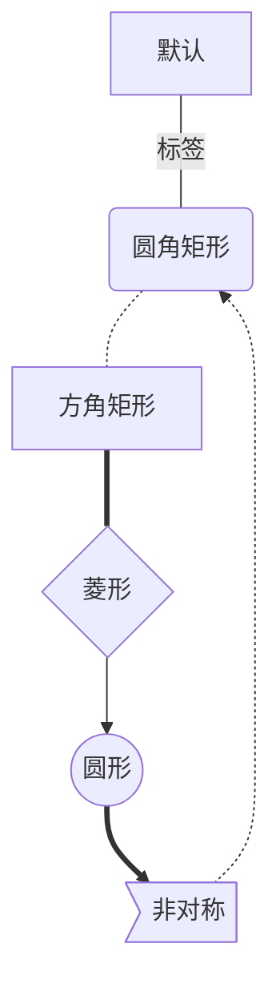
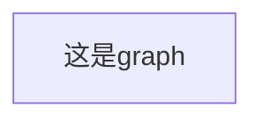
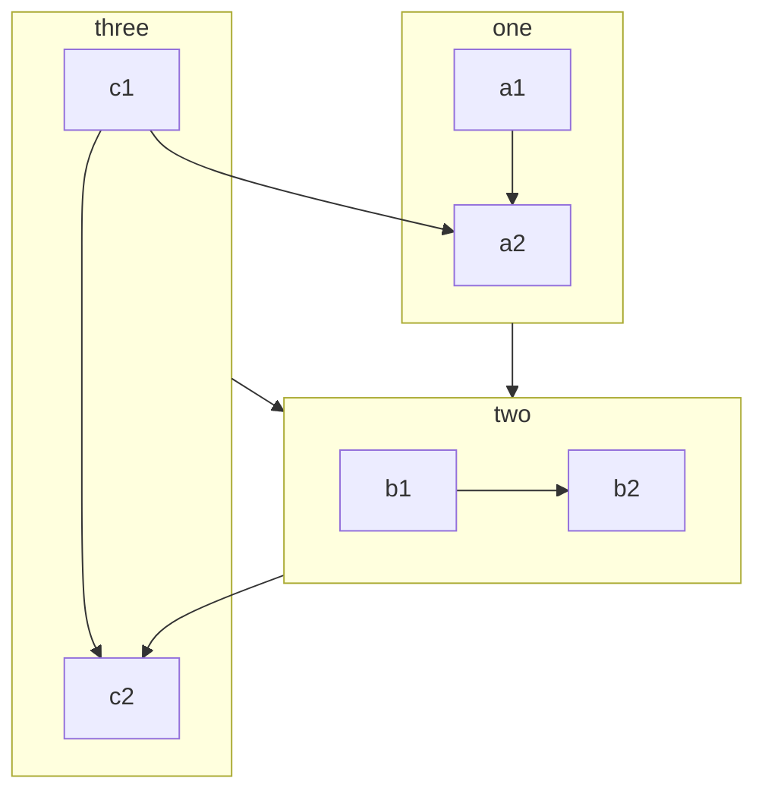

# 前言

在Markdown中，可以使用特定的语法来绘制简单的流程图。这种语法通常是通过Mermaid插件实现的，它允许你在Markdown文档中创建图表，包括流程图、序列图和甘特图等。


> **因版本或编辑器不同等等原因部分语法不普遍适用** 


# 1、基础讲解

## 1.1、mermaid定义

```markdown
​```mermaid
	语句
​```
```

## 1.2、基础语法

### 1.2.1、节点类型

- 默认
- 圆角矩形:`()`
- 方角矩形:`[]`
- 菱形:`{}`
- 圆形:`(())`
- 非对称:`>]`

_节点名称（节点显示内容）_

```markdown
​```mermaid
	graph TB
	默认
	A(圆角矩形)
	B[方角矩形]
	C{菱形}
	D((圆形))
	E>非对称]
​```
```


### 1.2.2、流程方向

|  符号  |                含义                 |
| :----: | :---------------------------------: |
| TB /TD | 从上到下（Top to Bottom）的流程方向 |
|   BT   | 从下到上（Bottom to Top）的流程方向 |
|   LR   | 从左到右（Left to Right）的流程方向 |
|   RL   | 从右到左（Right to Left）的流程方向 |
|   HZ   |  水平方向（Horizontal）的流程方向   |
|   VT   |   垂直方向（Vertical）的流程方向    |

### 1.2.3、连线方式

- 线条
  - 直线:`---`
  - 虚线:`-.-`
  - 粗线:`===`
- 箭头
  - 单向箭头:`-->`
  - 单向圆点:`--o`
  - 单向叉号:`--x`
  - 双向箭头:`<-->`
  - 双向圆点:`o--o`
  - 双向叉号:`x--x`
- 标签
  - 

_节点名称 - - -节点名称_ 

```markdown
``mermaid
	graph TB
	默认  --标签--- A
	A(圆角矩形) -.- B
	B[方角矩形] === C
	C{菱形} --> D
	D((圆形)) ==> E
	E>非对称] -.->A
​```
```




### 1.2.4、节点样式

**节点类型**

|           属性            |    类型    |
| :-----------------------: | :--------: |
|        开始：start        |   椭圆形   |
|         结束：end         |   椭圆形   |
|      操作：operation      |    矩形    |
|   多输入操作：parallel    |    矩形    |
|    条件判断：condition    |    菱形    |
|   输入输出：in/out put    | 平行四边形 |
| 预处理/子程序：subroutine |   圣旨型   |


```
style 节点 样式
```

```markdown
​````mermaid
	graph TB
	A(圆角矩形)
	B[方角矩形]
	style A fill:#f9f,stroke:#333,stroke-width:4px
	style B fill:#bbf,stroke:#f66,stroke-width:2px,color:#fff,stroke-dasharray: 5 5
​```
```


​	

# 2、graph

```markdown
​```mermaid
graph LR
A[这是graph]
​```
```



```markdown
    graph TB
        c1-->a2
        subgraph one
        a1-->a2
        end
        subgraph two
        b1-->b2
        end
        subgraph three
        c1-->c2
        end
        one --> two
        three --> two
        two --> c2
```




# 3、flowchart

```markdown

​```mermaid
	flowchart LR
    s=>start: 开始
    s->
​```
如果使用flowchart未成功：
​```flow
    s=>start: 开始
    s->
​```
```

```flow
    s=>start: 开始
    s->
```

```markdown
	s=>start: 开始
	e=>end: 结束
	op1=>operation: 操作1 
	op2=>operation: 操作2 
	op3=>operation: 操作3 
	pa=>parallel: 多输出操作4 
	cond=>condition: 确认？
	
	s->op1->cond
	cond(true)->op3
	cond(no)->op2(right)->op1
	op3->pa
	pa(path3,right) ->e
	s@>op1({"stroke":"Pink"})@>cond({"stroke":"Blue","stroke-width":10})@>op3({"stroke":"Green"})@>pa({"stroke":"yellow"})@>e({"stroke":"red","arrow-end":"classic-wide-long"})
```


```flow
	s=>start: 开始
	e=>end: 结束
	op1=>operation: 操作1 
	op2=>operation: 操作2 
	op3=>operation: 操作3 
	pa=>parallel: 多输出操作4 
	cond=>condition: 确认？
	
	s->op1->cond
	cond(true)->op3
	cond(no)->op2(right)->op1
	op3->pa
	pa(path3,right) ->e
	s@>op1({"stroke":"Pink"})@>cond({"stroke":"Blue","stroke-width":10})@>op3({"stroke":"Green"})@>pa({"stroke":"yellow"})@>e({"stroke":"red","arrow-end":"classic-wide-long"})
```

- 节点定义

  ```
  变量名=>节点标识: 节点显示名
  ```

- 节点连线

  ```
  变量名1->变量名2->...->变量名n
  ```

- 连线样式

  ```
  变量名m@>变量名n({"key":"value"})
  ```

- 关键字

  - yes/true：condition类型变量连接时，用于分别表示yes条件的流向
  - no/false：同上，表示否定条件的流向
  - left/right：表示连线出口在节点位置（默认下面是出口，如op3），可以跟condition变量一起用：cond(yes,right)
  - path1/path2/path3：parallel变量的三个出口路径（默认下面是出口）