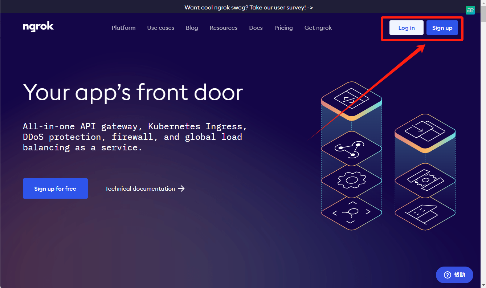
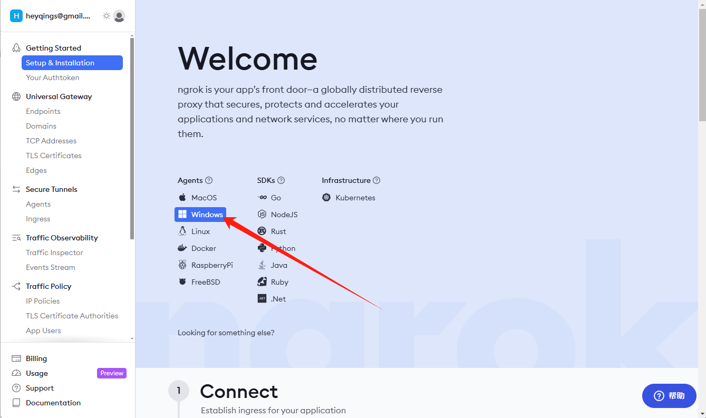
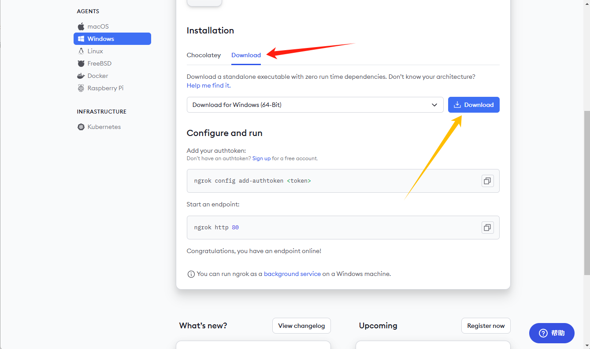
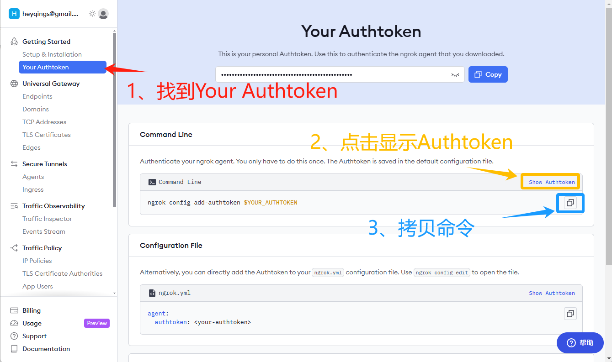
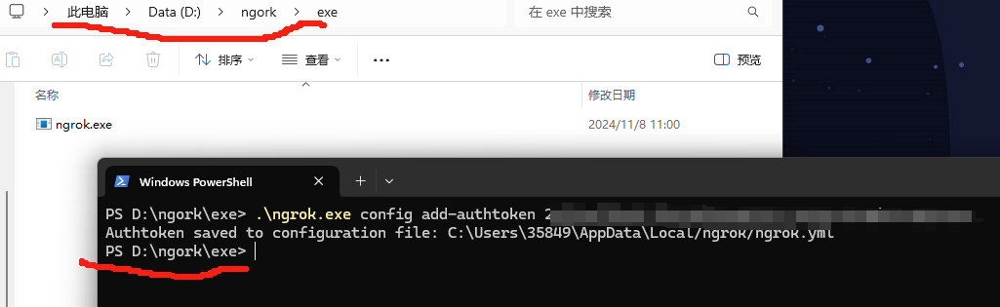
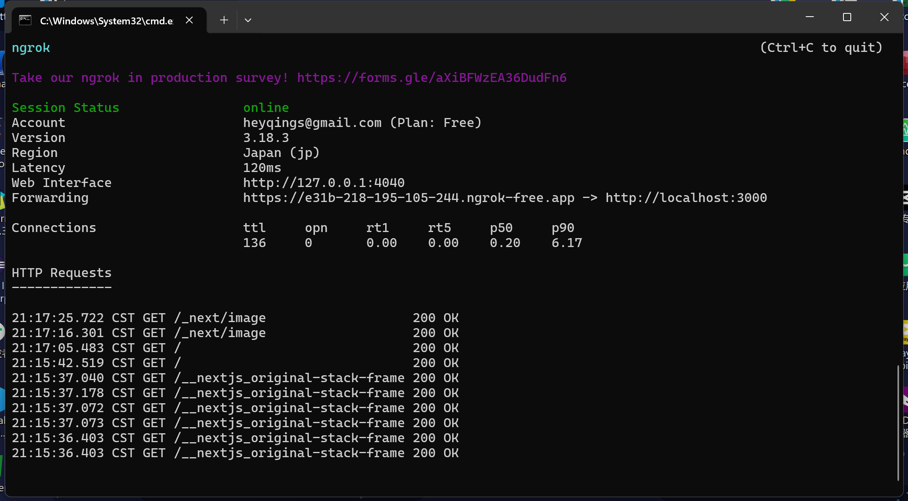

# Ngrok实现内网穿透（Windows）

## 什么是内网穿透，内网穿透有什么用

**内网穿透**（NAT traversal）是一种技术手段，使得位于内网或防火墙后面的设备能够通过外网访问。例如，如果你的计算机、服务器等设备处于公司或家庭的路由器后面，通常只有同一内网中的设备能够直接访问它，外网用户无法直接连接。内网穿透通过创建外部访问通道，使得外网用户能够与这些内网资源交互。

**内网穿透的用途**

1. **远程访问内网服务**：在外网环境中，用户可以远程访问自己家里或公司内网中的电脑、服务器、摄像头等设备，进行文件传输、桌面控制等操作。
2. **服务器部署**：个人或企业可以将某些服务部署在内网中，通过内网穿透将这些服务发布到互联网上，使得它们无需复杂的公网 IP 配置即可被外界访问。
3. **内网开发调试**：开发者在本地搭建服务后，可以通过内网穿透提供给外网的同事或客户测试访问，便于调试和演示，尤其在展示网站或应用时十分便捷。

## 下载并注册

[ngork官网](https://ngrok.com/)

```
https://ngrok.com/
```

打不开网址可前往 [科学上网]()

点击右上角 【sign up】注册可使用（Google 或 Github 账号登录）



账号注册登录成功后，点击【Windows】来到下载界面 [下载界面](https://download.ngrok.com/windows)



发现下载有两种方法

一种是使用命令行

```dos
choco install ngrok
```

安装，但我不建议这样，点击【Download】



下载好后解压，来到【ngork.exe】级目录，打开【cmd】或【PowerShell】，然后到官网找到【Authtoken】，复制粘贴你的Authtoken，到本机执行



我这【ngork】放在D盘了



配置完成后就可以使用了

还是在刚刚的命令框输入命令

```dos
ngork http 你本机端口号
```

输入回车后，出现一下界面即成功



【Forwarding】即公网可访问域名

