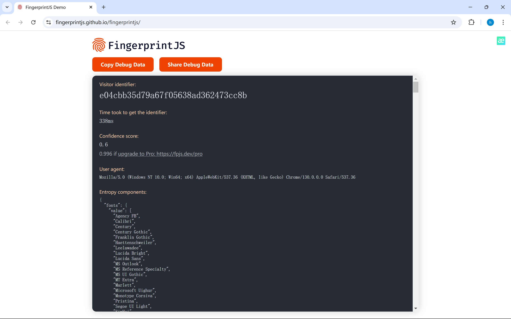
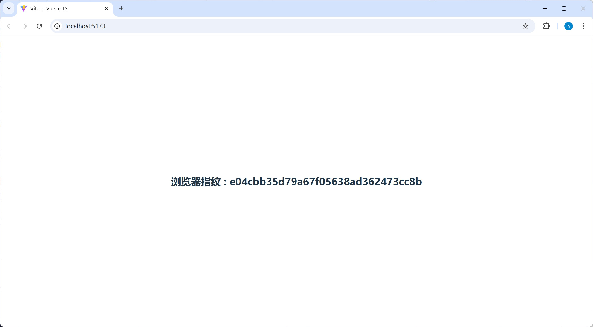
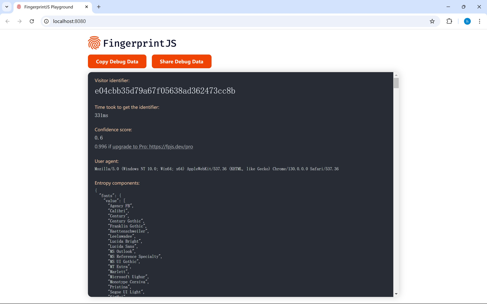
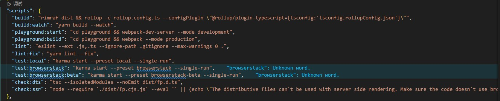
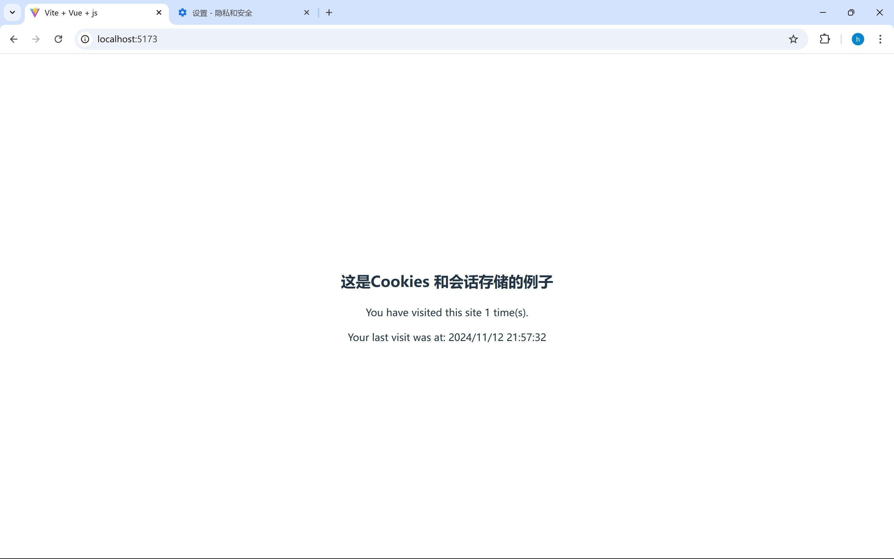
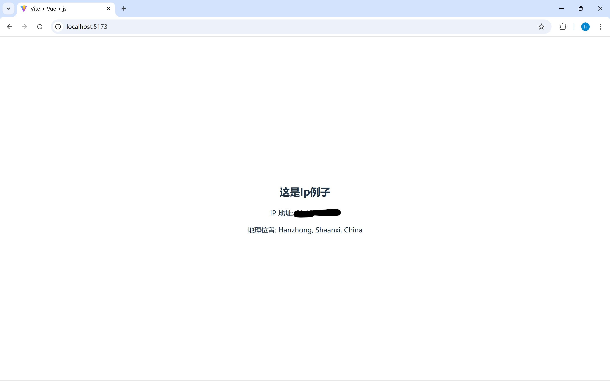

# **用户跟踪**（User Tracking）

在计算机中，用户追踪通常称为 **用户跟踪**（User Tracking）或 **用户行为追踪**（User Behavior Tracking）。它是指通过各种技术手段收集和分析用户在网络应用或软件上的行为和活动。

> 可以在用户不登录的情况下进行用户追踪，因为是不登录的所以用户追踪肯定做不到一对一的，只可能尽可能的保证精确、准确性

## 浏览器指纹

Browser Fingerprinting：通过收集用户浏览器的属性（如屏幕分辨率、操作系统、插件、语言设置等）生成一个独特标识，以便识别用户。

这里以Github上的 [fingerprintjs](https://github.com/fingerprintjs/fingerprintjs)（拥有$23.2K$的star数） 项目为例

项目介绍了项目的局限性和简单使用方法

局限性：

> 准确性 由于 FingerprintJS 在浏览器本身内部处理和生成指纹，因此准确性有限 (40% - 60%)。例如，当两个不同的用户使用相同的（即相同版本、相同供应商、相同平台）浏览器发送请求时，FingerprintJS 将无法区分这两个浏览器，主要是因为这些浏览器的属性是相同的。 安全 由于指纹是在浏览器本身内部处理和生成的，因此它们很容易受到欺骗和逆向工程的攻击。
>
> **但是**
>
> 指纹识别准确率高达 99.5% FingerprintJS 和指纹识别之间的主要区别在于从浏览器收集的属性数量、处理方式以及识别访问者的准确性。 指纹识别是一个闭源商业设备智能平台，旨在防止欺诈并改善用户体验。它是 FingerprintJS 的增强版本，经过全面重新设计，可以解决最具挑战性的识别用例。它的源代码在此或任何其他公共存储库中均不可用。 与 FingerprintJS 不同，指纹识别能够达到 99.5% 的准确率，因为它在服务器上处理浏览器属性，并分析大量辅助数据（例如 IP 地址、访问时间模式、URL 更改等）。由于这些先进的匹配技术，指纹识别能够可靠地消除具有相同特征的不同访问者的重复数据。

你可以直接点击 [fingerprintjs 官方](https://fingerprintjs.github.io/fingerprintjs/) 直接查看。

这是点击后的页面，`Visitor identifier`显示就是你的浏览器指纹，具有唯一性



当然人家也提供了代码使用教程，以下为简单示例

```js
<script>
  // Initialize the agent at application startup.
  // If you're using an ad blocker or Brave/Firefox, this import will not work.
  // Please use the NPM package instead: https://t.ly/ORyXk
  const fpPromise = import('https://openfpcdn.io/fingerprintjs/v4')
    .then(FingerprintJS => FingerprintJS.load())

  // Get the visitor identifier when you need it.
  fpPromise
    .then(fp => fp.get())
    .then(result => {
      // This is the visitor identifier:
      const visitorId = result.visitorId
      console.log(visitorId)
    })
</script>
```

只需复制粘贴即可获得你的浏览器指纹，这里是我的实例

```vue
<script setup lang="ts">
import { visitorId } from './components/fingerprintjs' 
// 我只是将https://openfpcdn.io/fingerprintjs/v4 代码下载到本地
</script>
<template>
  <div>
    <div class="finger">
      <h2>浏览器指纹 : {{ visitorId }}</h2>
    </div>
  </div>
</template>
<style scoped>
.logo {
  height: 6em;
  padding: 1.5em;
  will-change: filter;
  transition: filter 300ms;
}

.logo:hover {
  filter: drop-shadow(0 0 2em #646cffaa);
}

.logo.vue:hover {
  filter: drop-shadow(0 0 2em #42b883aa);
}
</style>

```

这是运行结果


当然你也可以将源码拉倒本地，阅读源码

```bash
git clone https://github.com/fingerprintjs/fingerprintjs.git
```

`clone`下来后先`npm install` 再 `npm run playground:start`即可运行项目，运行成功后访问`http://localhost:8080/`就可以看见你的浏览器指纹



这里再说明下`npm`运行运行命令



**build**：使用 `rimraf` 清空 `dist` 目录，然后使用 `rollup` 根据 `rollup.config.ts` 构建项目。`--configPlugin` 参数指定使用 `@rollup/plugin-typescript` 插件，并指定了 `tsconfig.rollupConfig.json` 作为 TypeScript 配置文件。

**build:watch**：监视模式下执行 `build`，在文件更改时自动重新构建。

**playground:start**：进入 `playground` 目录，启动 `webpack-dev-server` 开发服务器，以开发模式运行。

**playground:build**：进入 `playground` 目录，使用 `webpack` 以生产模式构建项目。

**lint**：使用 `eslint` 检查 JavaScript 和 TypeScript 文件的代码规范，忽略 `.gitignore` 中的文件并且不允许任何警告。

**lint:fix**：自动修复代码中 ESLint 检测到的错误。

**test:local**：使用 `karma` 在本地测试，适合在本地浏览器中运行单次测试。

**test:browserstack** 和 **test:browserstack:beta**：分别在 `browserstack` 和 `browserstack-beta` 配置下运行 `karma` 测试，用于在 BrowserStack 上的不同配置中进行单次测试。

**check:dts**：使用 `tsc` 编译 TypeScript 并检查 `dist/fp.d.ts` 文件，确保独立模块模式正确，并且没有输出。

**check:ssr**：检查项目是否能在服务器端渲染（SSR）环境中运行。如果代码使用了浏览器 API，则会输出错误并终止构建.

---

可以看见三种方式得出最后的浏览器指纹都一样，这是因为我使用的同一个浏览器打开的并且没有修改浏览器参数也没有修改代码生成的参数，源代码中你可以修改需要添加的参数，从而控制最后生成的Visitor identifier

注：我使用的时候碰到过

```
Firefox上：
vite] connecting... client:495:8
已拦截跨源请求：同源策略禁止读取位于 https://openfpcdn.io/fingerprintjs/v4 的远程资源。（原因：CORS 请求未能成功）。状态码：(null)。

位于“https://openfpcdn.io/fingerprintjs/v4”的资源已被内容拦截功能拦截。
localhost:5173
此文档不允许使用模块来源的 URI：“https://openfpcdn.io/fingerprintjs/v4”。 localhost:5173
[vite] connected. client:614:14
Uncaught (in promise) TypeError: error loading dynamically imported module: https://openfpcdn.io/fingerprintjs/v4 
=============================================================================
Edge上：
现在报错App.vue:2         
GET http://localhost:5173/utils/fingerprint.min.js net::ERR_BLOCKED_BY_CLIENT
setup @ App.vue:2
callWithErrorHandling @ runtime-core.esm-bundler.js:199
setupStatefulComponent @ runtime-core.esm-bundler.js:7870
setupComponent @ runtime-core.esm-bundler.js:7831
mountComponent @ runtime-core.esm-bundler.js:5179
processComponent @ runtime-core.esm-bundler.js:5145
patch @ runtime-core.esm-bundler.js:4663
render2 @ runtime-core.esm-bundler.js:5942
mount @ runtime-core.esm-bundler.js:3904
app.mount @ runtime-dom.esm-bundler.js:1757
(匿名) @ main.ts:5
显示 9 更多框架
显示简略信息
localhost/:1  Uncaught (in promise) TypeError: Failed to fetch dynamically imported module: http://localhost:5173/utils/fingerprint.min.js
```

我查了查关闭电脑代理或在文件上添加上代理即可

## Cookies 和会话存储

Cookies & Session Storage：通过设置在用户浏览器中的小文件或会话存储数据，追踪用户在网站上的访问情况。

这是我写的简单示例，提前先说明一下

**解释**

1. Cookies：用于持久化存储用户的访问次数。每次用户访问页面时，`visitCount` 值会增加。这个值存储在浏览器的 Cookies 中，最多保存 7 天。
2. 会话存储 (Session Storage)：用于存储用户的当前访问时间，只在当前会话中有效。每次刷新页面时，访问时间会更新并存储在会话存储中。
3. 页面加载时：在 `window.onload` 事件中，JavaScript 会获取当前的访问次数和时间，并更新页面内容。

**运行示例**

1. 每次用户访问页面时，`visitCount` 会增加，且在页面中显示用户的访问次数和上次访问时间。
2. 用户刷新页面时，会显示当前的访问时间（来自于会话存储），并且访问次数会保留在 Cookies 中。

**结果**

- 页面会显示用户的访问次数（通过 Cookie 跟踪）。
- 会话存储会显示用户的上次访问时间。

这是代码部分

`finger.vue`

```vue
<template>
  <div>
    <h2>这是Cookies 和会话存储的例子</h2>
    <p id="visitor-info"></p>
  </div>
</template>
<script setup lang="js">
import './tracking.js';  
</script>
<style scoped></style>
```

主要的js文件`tracking.js`

```js
// 获取当前日期时间作为用户访问时间
function getCurrentTime() {
  const now = new Date();
  return now.toLocaleString();
}

// 获取或设置 Cookies
function getCookie(name) {
  const value = `; ${document.cookie}`;
  const parts = value.split(`; ${name}=`);
  if (parts.length === 2) return parts.pop().split(';').shift();
}

// 设置 Cookies
function setCookie(name, value, days) {
  const d = new Date();
  d.setTime(d.getTime() + (days * 24 * 60 * 60 * 1000));
  const expires = `expires=${d.toUTCString()}`;
  document.cookie = `${name}=${value}; ${expires}; path=/`;
}

// 设置会话存储
function setSessionStorage(key, value) {
  sessionStorage.setItem(key, value);
}

// 页面加载时追踪用户信息
window.onload = function () {
  let visitCount = parseInt(getCookie('visitCount')) || 0;
  visitCount += 1;
  setCookie('visitCount', visitCount, 7);  // Cookie保存7天

  // 设置当前访问时间到会话存储
  const visitTime = getCurrentTime();
  setSessionStorage('lastVisitTime', visitTime);

  // 显示用户访问信息
  const visitorInfo = document.getElementById('visitor-info');
  visitorInfo.innerHTML = `
    <p>You have visited this site ${visitCount} time(s).</p>
    <p>Your last visit was at: ${sessionStorage.getItem('lastVisitTime')}</p>
  `;
};
```

运行结果
第一次访问时，中间显示 `You have visited this site 1 time(s).`访问了1次



刷新页面有


## IP 地址追踪

利用用户的 IP 地址进行地理位置的定位，以识别用户的来源。

你可使用 [ipinfo.io](https://ipinfo.io/). 代码为

```js
// 使用 ipinfo.io 获取用户的 IP 地址和位置信息
function getGeoLocation() {
  fetch('https://ipinfo.io/json?token=YOUR_ACCESS_TOKEN') // 替换为你的 ipinfo.io API token
    .then(response => response.json())
    .then(data => {
      const location = data.city + ', ' + data.region + ', ' + data.country;
      const ip = data.ip;
      document.getElementById('location-info').innerHTML = `
        您的 IP 地址是: ${ip}<br>
        您的地理位置是: ${location}
      `;
    })
    .catch(error => {
      console.error('获取位置时出错:', error);
      document.getElementById('location-info').innerHTML = '无法获取位置信息。';
    });
}

// 页面加载时调用函数获取地理位置
window.onload = getGeoLocation;
```

但是ipinfo.io有使用限制只能试用7天过后就要收费就很难受，所以我使用 **ip-api**  [ip-api 官网](http://ip-api.com)

ip-api也是有请求次数限制但是相比那个好的多

> 免费版每天可以进行最多 **45,000 次** 请求，且每分钟最多进行 **150 次请求**。如果你超过这个限制，就需要等待重置，或者升级到付费版。

`vue`文件

```vue
<template>
  <div>
    <h2>这是Ip例子</h2>
    <p>IP 地址: {{ ip }}</p>
    <p>地理位置: {{ location }}</p>
  </div>
</template>

<script setup lang="js">
import { ref } from 'vue';

// 定义响应式数据
const ip = ref('');
const location = ref('');

// 导入 geo-location.js 文件
import './geo-location.js';

// 使用 `window` 来访问 geo-location.js 中的全局变量或函数
window.updateGeoLocation = (newIp, newLocation) => {
  ip.value = newIp;
  location.value = newLocation;
};
</script>

<style scoped></style>
```

重要的`js`文件，`geo-location.js`

```js
<template>
  <div>
    <h2>这是Ip例子</h2>
    <p>IP 地址: {{ ip }}</p>
    <p>地理位置: {{ location }}</p>
  </div>
</template>

<script setup lang="js">
import { ref } from 'vue';

// 定义响应式数据
const ip = ref('');
const location = ref('');

// 导入 geo-location.js 文件
import './geo-location.js';

// 使用 `window` 来访问 geo-location.js 中的全局变量或函数
window.updateGeoLocation = (newIp, newLocation) => {
  ip.value = newIp;
  location.value = newLocation;
};
</script>

<style scoped></style>
```

运行结果




## 不登录进行用户追踪分析

### 不登录进行用户追踪的好处

1. **隐私保护**：不登录可以保护用户的个人信息不被收集和滥用，尤其是在用户不愿意提供个人信息的情况下。
2. **匿名性**：用户可以在不透露个人身份的情况下浏览和使用网站或应用，这对于那些希望保持匿名的用户来说是非常重要的。
3. **便捷性**：用户不需要创建账户或记住密码，只需点击即可开始使用，这大大简化了用户的操作流程。
4. **减少摩擦**：对于一些用户来说，创建账户可能会感到繁琐，不登录可以减少这种摩擦，提高用户的满意度。

### 不登录进行用户追踪的坏处

1. **数据准确性**：由于无法获取用户的个人信息，追踪的数据可能不够准确，无法提供个性化的服务或内容。
2. **缺乏个性化**：不登录的用户无法享受到个性化的服务或内容，这可能会影响用户的体验和满意度。
3. **难以追踪用户行为**：不登录的用户行为难以追踪，这对于网站或应用的数据分析和优化来说是不利的。
4. **缺乏用户参与度**：不登录的用户可能不太愿意参与到网站或应用的社区中，这可能会影响用户的参与度和忠诚度。