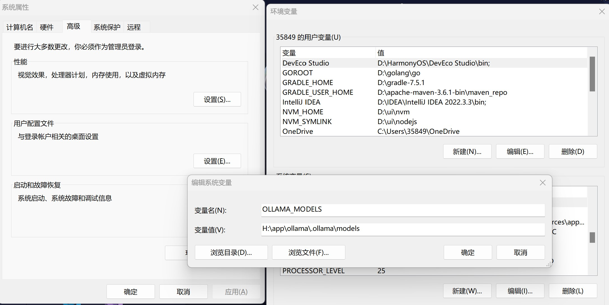
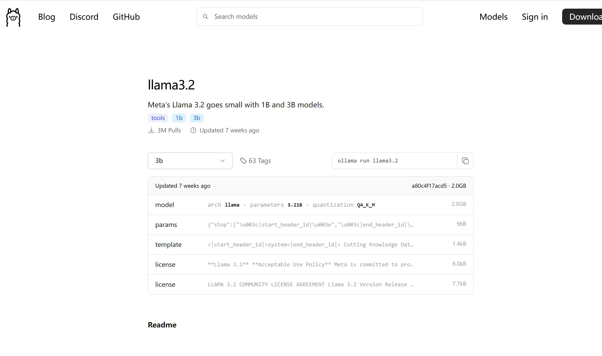

# Windows 下载部署 Ollama

## 什么是Ollama

**Ollama** 是一个轻量级的本地推理工具，主要用于运行 AI 模型。它允许用户在本地设备上运行和交互基于大语言模型（LLM）的应用，而无需依赖云服务。这种工具的主要优势是隐私保护和低延迟，尤其适合那些需要处理敏感数据或希望脱离互联网的场景。

以下是一些 Ollama 的关键特点：  
1. **离线运行**：不需要连接云端，完全本地推理。  
2. **支持多种模型**：可加载不同的 LLM，例如一些开源的语言模型。  
3. **跨平台支持**：通常支持在 macOS、Windows 和 Linux 等系统上运行。  
4. **用户友好**：提供简洁的接口和配置，适合开发者和非技术用户。  

[Ollama官网](https://ollama.com/)

```
https://ollama.com/
```

[Ollama Github地址](https://github.com/ollama/ollama)

```
https://github.com/ollama/ollama
```

这里我以Windows为例，在本地部署一台AI模型平台

## Windows 下载部署Ollama

### 1.下载 Ollama应用程序

[Ollama下载地址](https://ollama.com/download)

```
https://ollama.com/download
```

下载后会得到一个【OllamaSetup.exe】文件，双击运行安装【Install】即可，安装完成会提示`Ollama running`,你电脑右下角的状态栏里会有一个羊驼的logo

Ollama默认开机启动（几乎不会影响开机速度）

### 2.修改Ollama配置（可跳过）

【Ollama】大模型下载地址默认在`C:\Users\用户名\.ollama\models`

大模型的地址最好还是更改地址（毕竟真的很大,当然不改也可以）

#### **修改Ollama模型下载地址**

右击我的电脑点击【属性】或在设置中搜索【查看高级系统设置】点击，打开【系统属性】，然后点击【环境变量】，在下面的【系统变量】中点击【新建】添加下面这段话

变量名：`OLLAMA_MODELS`

变量值：`H:\app\ollama\.ollama\models`

变量名**不能变**，变量值为你想要存放ollama 模型的地址



配置完成可打开【cmd】命令行窗口查看，输入

```
echo %ollama_models%
```

出现刚刚配置的路径就是正确情况

#### 修改Ollama默认端口号

Ollama默认在`11434`端口运行

在【环境变量】的【用户变量】中添加

变量名：`OLLAMA_HOST`

变量值：`:114344`

设置成功后访问`http:\\127.0.0.1:114344`屏幕上会出现【Ollama is running】字样

### 3.下载Docker

问什么要下载Docker,不下载docker也是可以使用Ollama的是不过大多是在【PowerShell】这样的命令行窗口内（像这样的可以直接看下面下载Ollama大模型），下载Docker后可以使用其的**WebUI**，官方也是推荐这样，下面我们开始安装Docker。

#### 下载docker桌面端

- 打开windows子系统

点击键盘【win】键，搜索打开【控制面板】，点击【程序】，然后再点击【启用或关闭Windows功能】，下拉到底下找到【适用于Linux的Windows子系统】，点击选上后点【确定】。功能启动需要重启后启用

> 重启前先点赞收藏下呗，万一找不到该咋办 `^_^`

- 先确保wsl2更新至最新

查看wsl2版本

```bash
wsl --version
```

如果不是可使用`wsl --update`进行更新

```bash
wsl --update
```

也可手动安装前往[WSL](https://aka.ms/wsl2kernel)下载

- 下载docker

前往[docker 官网](https://www.docker.com/products/docker-desktop/)下载Windows桌面版

```
https://www.docker.com/products/docker-desktop/
```

下载好后会提醒重启电脑

> 还是那就话：重启前先点赞收藏下呗，万一找不到该咋办 `^_^`

- 配置docker resources（可选）

配置resources地址会改变images下载的位置

打开Docker桌面版（一般会提醒你登录，其实不登录也可以使用），点击右上角的【设置】图标，再点击【Resources】就会看到当前images下载位置，你可点击【Browse】进行更改

> Docker 默认是双击就启动，启动后在屏幕右下角状态栏可看到

- 拉取并运行Ollama镜像

拉取并运行只需要这一段程序即可

打开【cmd】输入

```bash
docker run -d -p 9876:8080 --add-host=host.docker.internal:host-gateway -v open-webui:/app/backend/data --name open-webui --restart always ghcr.io/open-webui/open-webui:main
```

使用`9876`端口作为WebUI入口，可修改；`-v`为日志输出路径，可修改；`--name`后为镜像名字，可修改；`--restart`为开启自启动

启动成功后访问`http:\\127.0.0.1:9876`可以看见


默认为登录页面我这是注册登录过后的

### 4.下载Ollama大模型并使用

前往 [Ollama Lib 下载](https://ollama.com/library)

```
https://ollama.com/library
```

点击你想下载的大模型，我这里以`llama3.2`为例

#### PowerShell下载（不推荐）



复制`ollama run llama3.2`在powershell中运行即可，下载成功就可以访问了

#### Docker下载

打开上述的`http://127.0.0.1:9876`页面


下载完成后,回到主页【点击新对话】就可以使用了

